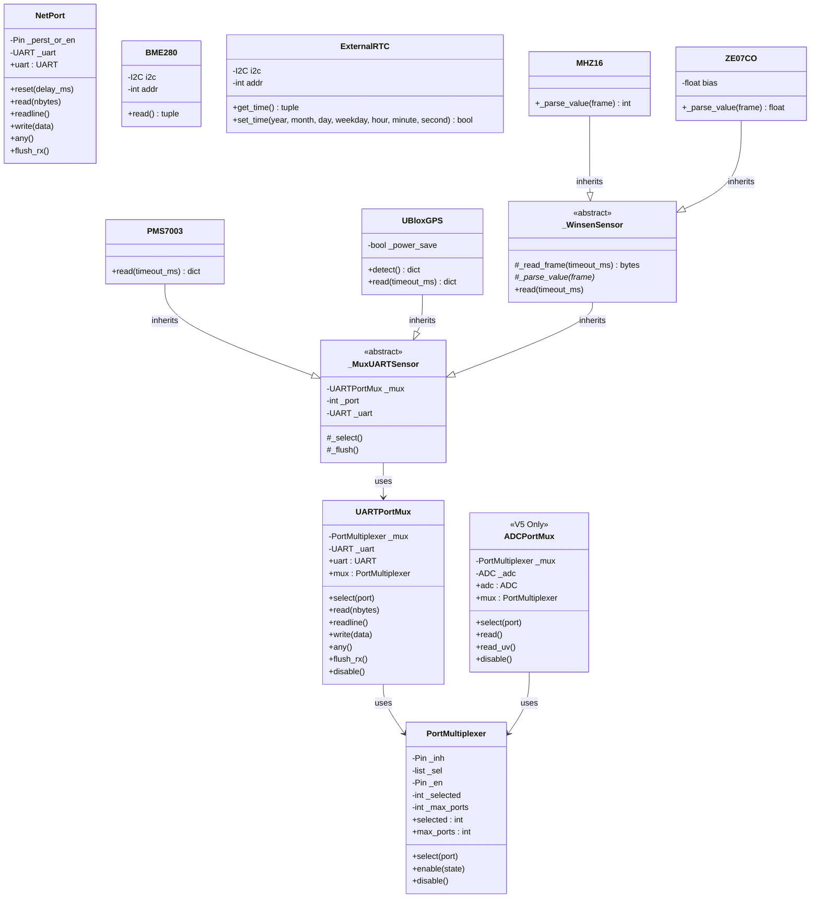

# Canarin Board Ports Reference Manual (V5 & V6)

Welcome to the technical reference manual and developer documentation for the custom MicroPython board ports designed for the **Canarin** environmental monitoring devices! This guide is written to help you write MicroPython applications for the Hazemon sensor nodes running on ESP32 (V5) and ESP32-S3 (V6) hardware.

## 1. Getting Started

MicroPython, with all its features, has been ported to Canarin5 and Canarin6. You can find the port in [CANARIN_V5](ports/esp32/boards/CANARIN_V5) and [CANARIN_V6](ports/esp32/boards/CANARIN_V6). A helper library called `canarin` is included for both platforms to help you develop applications quickly. 

The boards have been added following the standard ESP32 port guide located in [MicroPython port to the ESP32](ports/esp32/README.md). Please read this document to understand how to setup the repo for port based builds.

The `canarin` module is frozen directly into the MicroPython firmware for both boards. It wraps hardware-level details, such as multiplexer switching timings, BCD conversion registers for the clocks, load switch gating, and packet parsing, into clean and Pythonic classes.

To start writing an application, just import the module at the top of your script:
```python
import canarin
```

[ports/esp32/boards/CANARIN_V5/main.py](ports/esp32/boards/CANARIN_V5/main.py) and [ports/esp32/boards/CANARIN_V5/main.py](ports/esp32/boards/CANARIN_V5/main.py) would be a good place to start to modify manufacturing tests as well as learn to develop new micro-python application on top of this firmware.

### Building the Firmware

To build the custom firmware for Canarin boards, two helper scripts are provided in the `ports/esp32` directory:
*   `make_can5_bin.sh`: Builds the firmware for the Canarin V5 board (ESP32) and merges the bootloader, partition table, and MicroPython binary into a single file `build-CANARIN_V5/can5-test.bin`.
*   `make_can6_bin.sh`: Builds the firmware for the Canarin V6 board (ESP32-S3) and merges the components into a single file `build-CANARIN_V6/can6-test.bin`.

**Important Note:** Before running the build scripts, make sure you have activated your ESP-IDF 5 environment!

You can execute these scripts directly from the `ports/esp32` directory:
```bash
cd ports/esp32
# Ensure you run the ESP-IDF export.sh script first!
. /path/to/esp-idf/export.sh

./make_can5_bin.sh  # Build for Canarin V5
./make_can6_bin.sh  # Build for Canarin V6
```

**Changing source code in any file which is frozen in the firmware require a complete rebuilt.** Please deleted the corrosponding `build-CANARIN_V6` or `build-CANARIN_v5` directory. Then proceed with `./make_can5_bin.sh` or `./make_can6_bin.sh`. 

### Freezing Modules with `manifest.py`
If you want to freeze your own custom Python modules into the firmware to save RAM, you can modify the `manifest.py` file located in the board's directory. Freezing compiles the Python code into bytecode and bakes it into the flash memory, leaving more RAM available for your application.

### Application Development and Thonny

By default, the firmware includes a test application located at `ports/esp32/boards/CANARIN_V5/main.py` (or `CANARIN_V6/main.py`) which is frozen into the firmware and runs automatically on boot. 

**Removing the default test or adding a custom application:**
*   **To remove the default test:** Update `manifest.py` in the board's directory (`ports/esp32/boards/CANARIN_V5/main.py` or `CANARIN_V6/main.py`) before building the firmware. You will need to remove the line in `manifest.py` that explicitly includes `main.py`.
*   **To add a custom application during build:** Place your custom `.py` files in the board directory (replacing `main.py`) and update `manifest.py` to include the script before running the build scripts. These files will be compiled and frozen into the firmware.

**Developing with Thonny:**
For a rapid development cycle without rebuilding firmware, we recommend using the [Thonny IDE](https://thonny.org/):
1.  Flash the Canarin firmware onto your board using `esptool.py` (the exact command is printed when the build scripts finish).
2.  Open Thonny, go to **Tools > Options > Interpreter**.
3.  Select **MicroPython (ESP32)** as the interpreter and choose the correct COM port for your board.
4.  You can now use the REPL, upload files directly to the device's internal filesystem (like a custom `main.py` to override the frozen one), and run scripts interactively. Note that a `main.py` placed on the device's filesystem will take precedence over a frozen `main.py`.

---

## 2. Hardware Overview

| Feature / Interface | Canarin V5 (Legacy) | Canarin V6 (Current S3) |
| :--- | :--- | :--- |
| **Microcontroller** | ESP32-WROOM-32 | ESP32-S3-WROOM-1 (N8R8 variant) |
| **System Memory** | 4 MB Flash / 520 KB SRAM | 8 MB Flash / 8 MB Octal PSRAM |
| **Default I2C0 Bus** | SDA = GPIO21, SCL = GPIO22 | SDA = GPIO1, SCL = GPIO2 |
| **SD Card SPI** | Standard VSPI slot 2 pins | Custom S3 routing (Slot 2) |
| **On-board RTC** | ISL1219 ($I^2C$ address `0x6F`) | DS3231 ($I^2C$ address `0x68`) |
| **UART Mux Channels** | 8 channels (3-bit selection) | 4 channels (2-bit selection) |
| **ADC Mux Channels** | 4 channels (2-bit selection) | *Not present* |
| **Net Port (Modem)** | UART1 with Hardware Reset Pin | UART1 with Power Enable |
| **Power Control** | Always-On | Load switches for Sensor rail & Modem |

---

## 3. Pinout Reference Cheat Sheet

These mappings are registered in the board-specific [pins.csv](ports/esp32/boards/CANARIN_V5/pins.csv) and [pins.csv](ports/esp32/boards/CANARIN_V6/pins.csv) configurations. You can access them programmatically using `machine.Pin.board.PIN_NAME`.

```
Canarin V5 (ESP32)                          Canarin V6 (ESP32-S3)
┌───────────────────────┐                  ┌───────────────────────┐
│ I2C: SDA=21, SCL=22   │                  │ I2C: SDA=1, SCL=2     │
│ SD: MOSI=23 MISO=19   │                  │ SD: MOSI=11 MISO=13   │
│     SCK=18  CS=5      │                  │     SCK=12  CS=10     │
│                       │                  │                       │
│ UART Mux:             │                  │ UART Mux:             │
│   SEL0=4, SEL1=2      │                  │   SEL0=15, SEL1=16    │
│   SEL2=15, EN=27      │                  │   EN=5, INH=7         │
│   INH=12              │                  │   TX=48, RX=47        │
│   TX=16, RX=17        │                  │                       │
│                       │                  │ Power Control:        │
│ ADC Mux:              │                  │   Sensors = GPIO5     │
│   SEL0=25, SEL1=26    │                  │   Modem = GPIO4       │
│   SIG=33, EN=14       │                  │                       │
│ Net Port:             │                  │ Net Port:             │
│   TX=32, RX=35        │                  │   TX=17, RX=18        │
│   Reset=13            │                  │   Reset=38            │
└───────────────────────┘                  └───────────────────────┘
```

---

## 4. Core System & Power Control APIs

### 4.1. Reading Board Information
Retrieve the board version programmatically to load version-specific features, like sensor channel mapping.
```python
import canarin

version = canarin.get_version()
print(f"Running on Canarin Hardware Version: {version}")
# Returns: "V5" or "V6"
```

### 4.2. Power Gating (Canarin V6 Specific Load Switches)
To conserve battery charge, Canarin V6 allows you to cut power completely to the UART sensor rail and the cellular modem or Ethernet slot when not actively taking measurements. On Canarin V5, these calls are safe no-ops.

```python
import time
import canarin

# 1. Power on the sensor rail and cellular modem load switches (V5 does not do anything)
canarin.enable_sensor_power()
canarin.enable_netport_power()

time.sleep(1.0) 


# 2. Shutdown power rails to enter low-power sleep mode (v5 does not do anything)
canarin.disable_sensor_power()
canarin.disable_netport_power()
```

---

## 5. Storage (MicroSD Card)

The SD card is interfaced via SPI in VSPI mode (Slot 2). 

```python
import canarin

# Mount the SD Card to a custom path (defaults to '/sd')
try:
    mount_path = canarin.mount_sd("/sd")
    print(f"SD Card successfully mounted at: {mount_path}")
    
    # Write a test log entry
    with open("/sd/telemetry.csv", "a") as log:
        log.write("timestamp,temp,humidity,co2\n")
        
except OSError as err:
    print("Failed to mount SD card. Make sure it is formatted as FAT32:", err)
finally:
    # Always safely unmount the card before deep sleep to prevent filesystem corruption
    canarin.umount_sd("/sd")
```

---

## 6. On-Board Bus & RTC Reference

### 6.1. Ambient BME280 Sensor
The BME280 sensor reads ambient temperature, barometric pressure, and relative humidity. It resides on default $I^2C$ channel 0.

```python
from machine import I2C
import canarin

# Default I2C0 maps to correct pins automatically (V5: SDA=21/SCL=22 | V6: SDA=1/SCL=2)
i2c = I2C(0)

# Initialize the driver, with the i2c object
bme = canarin.BME280(i2c)

# Take a single measurement 
temperature, pressure, humidity = bme.read()

print(f"Temperature: {temperature:.1f} °C")
print(f"Pressure:    {pressure:.1f} hPa")
print(f"Humidity:    {humidity:.1f} %")
```

### 6.2. External RTC (ISL1219 or DS3231)
The external RTC keeps track of wall-clock time even when the microcontroller sleeps or loses power. Address and driver specifics are handled automatically.

```python
from machine import I2C
import canarin

i2c = I2C(0)

# Initialize the RTC using the board-defined address:
# V5 uses ISL1219 (0x6F) | V6 uses DS3231 (0x68)
rtc = canarin.ExternalRTC(i2c, addr=canarin.ExternalRTC.RTC_ADDR)

# Set the RTC date & time to July 14, 2026 12:45:00 (Tuesday = weekday 2)
# Format: (year, month, day, weekday, hour, minute, second)
rtc.set_time(2026, 7, 14, 2, 12, 45, 0)

# Read the time back
now = rtc.get_time()
if now:
    year, month, day, weekday, hour, minute, second = now
    print(f"RTC Date: {year:04d}-{month:02d}-{day:02d}")
    print(f"RTC Time: {hour:02d}:{minute:02d}:{second:02d}")
```

---

## 7. Multiplexed Sensor Port Reference

Because microcontrollers have limited hardware UARTs and ADCs, the Canarin design uses analog switches to route data. The `canarin` module handles the select pin combinations and safe inhibit transitions automatically.

### 7.1. Low-Level Port Switching (UARTPortMux)
```python
import canarin

# Initialize the digital mux wrapper (defaults to UART2, 9600 baud)
mux = canarin.UARTPortMux()

# Select UPORT channel 1 
mux.select(1)

# Write custom command to the routed sensor
mux.write(b"\x11\x01\x01\xED")

# Read response
if mux.any():
    response = mux.read(8)
    print("Received bytes:", response)

# Release selection / power down the mux chip to prevent cross-channel noise
mux.disable()
```

### 7.2. PM Sensor (PMS7003)
Operates in passive (polled) mode at 9600 baud.
```python
import canarin

mux = canarin.UARTPortMux()

# Port mapping is board specific (V5: Channel 1 | V6: Channel 0) and needs to be selected appriopriately.
pm_sensor = canarin.PMS7003(mux, port=0)

# Take a reading
data = pm_sensor.read(timeout_ms=2000)
if data:
    print(f"PM1.0 (Atmospheric): {data['pm1_0_atm']} ug/m3")
    print(f"PM2.5 (Atmospheric): {data['pm2_5_atm']} ug/m3")
    print(f"PM10  (Atmospheric): {data['pm10_atm']} ug/m3")
else:
    print("PM Sensor read failed or timed out.")
```

### 7.3. CO2 Sensor (MH-Z16)
Operates using the Winsen 9-byte frame query protocol.
```python
import canarin

mux = canarin.UARTPortMux()

# MH-Z16 is tested on Port 3 for V5 boards
co2_sensor = canarin.MHZ16(mux, port=3)

ppm = co2_sensor.read(timeout_ms=1000)
if ppm is not None:
    print(f"CO2 Concentration: {ppm} ppm")
else:
    print("CO2 Sensor timed out.")
```

### 7.4. CO Sensor (ZE07-CO)
Similar to the CO2 sensor but supports calibration offset (bias).
```python
import canarin

mux = canarin.UARTPortMux()

# Connects to Port 7 on V5 boards.
co_sensor = canarin.ZE07CO(mux, port=7)

co_ppm = co_sensor.read(timeout_ms=1000)
if co_ppm is not None:
    print(f"Carbon Monoxide: {co_ppm:.2f} ppm")
else:
    print("CO Sensor failed.")
```

### 7.5. u-blox GPS Receiver (UBloxGPS)
Uses high-speed binary parsing (`UBX` packets) instead of slow ASCII string parsing.
```python
import canarin

mux = canarin.UARTPortMux()

# Initialize GPS receiver (V5: Port 6 | V6: Port 2)
# Configures the receiver to operate in UBX binary mode automatically
gps = canarin.UBloxGPS(mux, port=2, configure=False)

# 1. Query internal module information
info = gps.detect()
if info:
    print(f"GPS Engine: {info['hw_version']} (FW: {info['sw_version']})")

# 2. Get a live satellite location fix
fix = gps.read(timeout_ms=1500)
if fix and fix["fix"]:
    print(f"Coordinates: {fix['lat']:.6f}°N, {fix['lon']:.6f}°E")
    print(f"Altitude:    {fix['alt']:.1f} m")
    print(f"Satellites:  {fix['n_sat']}")
    print(f"Speed:       {fix['vel_east']:.2f} m/s East")
else:
    print("No GPS satellite fix available yet.")
```


---

## 8. Cellular Modem Interface (NETPORT)

`NetPort` runs on UART1 and provides wrappers for configuring and talking to cellular modems (like the SIM7600 series) or hardware Ethernet converters. The driver to convert UART to working Internet connection is not implemented.

```python
import time
import canarin

# V6 power rails: enable modem load switch first
canarin.enable_netport_power()
time.sleep(15) # Wait for modem startup boot cycle

# Initialize NetPort wrapper (typically baud 115200 for modems)
modem = canarin.NetPort(baudrate=115200, timeout_ms=1000)


# Send standard Hayes AT commands
modem.write(b"AT\r\n")
time.sleep(0.5)

if modem.any():
    response = modem.read()
    print("Modem response:", response.decode())
    
# Flush buffers
modem.flush_rx()
```

---

## 9. MicroPython API Reference

### 9.1. Driver Class Diagram

The UML class diagram below outlines the inheritance hierarchy, interface dependencies, and composition associations within the frozen `canarin` module:



---

### 9.2. Board Information and Power Management

#### `get_version()`
*   **Returns**: `str` (`"V5"` or `"V6"`) depending on the firmware and board configuration.

#### `enable_sensor_power()` / `disable_sensor_power()`
*   Enablers or disablers of power routing to the UPORT sensor rail.
*   **Behavior**:
    *   **V5**: No-op (the sensor rail is hard-wired and always-on).
    *   **V6**: Drives `UPORT_EN` (GPIO5) high (`1`) to power up, and low (`0`) to sleep.

#### `enable_netport_power()` / `disable_netport_power()`
*   Enablers or disablers of power routing to the NETPORT slot (modem or Ethernet adapter).
*   **Behavior**:
    *   **V5**: No-op.
    *   **V6**: Drives `NETPORT_EN` (GPIO4) high (`1`) to supply power, and low (`0`) to cut power.

---

### 9.3. Storage Management

#### `mount_sd(mount_point="/sd")`
*   Mounts the MicroSD card (FAT filesystem format) onto the specified directory path.
*   **Parameters**: `mount_point` (`str`, default: `"/sd"`).
*   **Returns**: `str` (The absolute path of the mount point).

#### `umount_sd(mount_point="/sd")`
*   Safely unmounts and closes the MicroSD filesystem and card interface.
*   **Parameters**: `mount_point` (`str`, default: `"/sd"`).

---

### 9.4. Multiplexer Controller APIs

#### `class PortMultiplexer(inh_pin, sel_pins, en_pin=None)`
Low-level controller for the analog and digital multiplexers.
*   **Methods**:
    *   `select(port)`: Switches the active channel selection. Pulls `MUX_INH` high (inhibiting routing) during transitions, sets selection pins to the binary index of `port`, and drives `MUX_INH` low after a brief delay.
    *   `enable(state=True)`: Drives the `en_pin` (if present) to enable or disable the multiplexer chip.
    *   `disable()`: Equivalent to `enable(False)`.
*   **Properties**:
    *   `selected` (`int`): Returns the currently selected port index.
    *   `max_ports` (`int`): Returns the maximum supported channels (derived from 2 to the power of `len(sel_pins)`).

#### `class UARTPortMux(uart_id=2, baudrate=9600, timeout_ms=1000, **uart_kwargs)`
High-level wrapper interfacing a hardware `machine.UART` instance with the `PortMultiplexer`.
*   **Methods**:
    *   `select(port)`: Switches the multiplexer routing to target a specific hardware channel.
    *   `read(nbytes=None)`: Read bytes from the UART buffer.
    *   `readline()`: Reads a line ending with a newline character.
    *   `write(data)`: Writes raw byte data to the port.
    *   `any()`: Returns the number of bytes available in the UART buffer.
    *   `flush_rx()`: Flushes all incoming data from the receive buffers.
    *   `disable()`: Disables the multiplexer control line.
*   **Properties**:
    *   `uart` (`machine.UART`): Returns the raw UART peripheral instance.
    *   `mux` (`PortMultiplexer`): Returns the underlying `PortMultiplexer` instance.

#### `class ADCPortMux(atten=ADC.ATTN_11DB)` *(V5 Only)*
High-level wrapper interfacing a hardware `machine.ADC` instance with the 4-channel analog multiplexer.
*   **Methods**:
    *   `select(port)`: Routes the ADC input to a target channel (0 to 3).
    *   `read()`: Returns the raw 12-bit digital reading (0 to 4095).
    *   `read_uv()`: Returns the calibrated voltage value in microvolts.
    *   `disable()`: Disables the analog mux select lines.

---

### 9.5. Environmental and Gas Sensors

#### `class BME280(i2c, addr=0x76)`
Driver for the Bosch BME280 temperature, pressure, and humidity sensor over I2C.
*   **Methods**:
    *   `read()`: Returns a tuple `(temp_C, pres_hPa, humi_pct)` representing temperature in Celsius, barometric pressure in hectopascals, and relative humidity in percentage.

#### `class PMS7003(uart_or_mux, port=None)`
Driver for the Plantower PMS7003 Particulate Matter sensor.
*   **Methods**:
    *   `read(timeout_ms=2000)`: Requests and reads a particulate matter data frame.
    *   **Returns**: `dict` on success (or `None` on timeout or checksum mismatch):
        ```python
        {
            "pm1_0_cf1": int,   # PM1.0 CF=1 standard particle (ug/m3)
            "pm2_5_cf1": int,   # PM2.5 CF=1 standard particle (ug/m3)
            "pm10_cf1":  int,   # PM10  CF=1 standard particle (ug/m3)
            "pm1_0_atm": int,   # PM1.0 under atmospheric environment
            "pm2_5_atm": int,   # PM2.5 under atmospheric environment
            "pm10_atm":  int    # PM10  under atmospheric environment
        }
        ```

#### `class MHZ16(uart_or_mux, port=None)`
Driver for the Winsen MH-Z16 NDIR CO2 sensor.
*   **Methods**:
    *   `read(timeout_ms=1000)`: Sends a request frame and parses the return data.
    *   **Returns**: `int` (CO2 concentration in ppm) or `None` on error.

#### `class ZE07CO(uart_or_mux, port=None, bias=0.0)`
Driver for the Winsen ZE07-CO electrochemical Carbon Monoxide sensor.
*   **Methods**:
    *   `read(timeout_ms=1000)`: Sends a request frame, parses the return data, and offsets it by the calibration bias.
    *   **Returns**: `float` (CO concentration in ppm) or `None` on error.

---

### 9.6. Networking and Location Services

#### `class NetPort(uart_id=1, baudrate=9600, timeout_ms=1000, **uart_kwargs)`
API to control communication and hardware state of the cellular modem or Ethernet slot.
*   **Methods**:
    *   `reset(delay_ms=1000)`: Performs a hardware reset cycle by toggling the control pin.
    *   `read(nbytes=None)` / `readline()` / `write(data)` / `any()`: standard serial wrapper functions.
    *   `flush_rx()`: Flushes incoming read buffers.

#### `class UBloxGPS(uart_or_mux, port=None, configure=True, power_save=False)`
Driver for u-blox NEO GPS receivers communicating over UBX binary protocol.
*   **Methods**:
    *   `detect()`: Polls the GPS hardware information. Returns a `dict` (e.g. `{"sw_version": str, "hw_version": str}`) or `None`.
    *   `read(timeout_ms=1500)`: Polls the device using `NAV-PVT` payloads.
    *   **Returns**: `dict` on success (or `None` on error):
        ```python
        {
            "lat": float,         # Latitude (decimal degrees)
            "lon": float,         # Longitude (decimal degrees)
            "alt": float,         # Altitude above MSL (meters)
            "n_sat": int,         # Number of tracked satellites
            "fix_type": int,      # Fix type (0: No Fix, 2: 2D, 3: 3D, etc.)
            "fix": bool,          # True if fully resolved 3D fix
            "vel_north": float,   # Velocity North (m/s)
            "vel_east": float,    # Velocity East (m/s)
            "vel_down": float,    # Velocity Down (m/s)
            "year": int,          # GPS resolved year (Optional, based on validity flags)
            "month": int,         # GPS resolved month (Optional)
            "day": int,           # GPS resolved day (Optional)
            "hour": int,          # GPS resolved hour (Optional)
            "min": int,           # GPS resolved minute (Optional)
            "sec": int            # GPS resolved second (Optional)
        }
        ```

---

### 9.7. Time Management

#### `class ExternalRTC(i2c, addr)`
Interfacing with the on-board external Real-Time Clock module (ISL1219 or DS3231).
*   **Methods**:
    *   `get_time()`: Retrieves the current time from the RTC.
        *   **Returns**: `tuple` `(year, month, day, weekday, hour, minute, second)` or `None` on bus read error.
    *   `set_time(year, month, day, weekday, hour, minute, second)`: Write configuration values to the RTC registers.
        *   **Returns**: `bool` `True` on successful write, `False` otherwise.

---

## 10. Manufacturing Test (`main.py`)

The [main.py](ports/esp32/boards/CANARIN_V5/main.py) script serves as the manufacturing test procedure and is run after flashing to verify assembly.

It performs testing in the following order:
1.  **Power Initialization**: Enables load switches (V6 only).
2.  **I2C Bus Scan**: Checks for devices attached to the I2C0 bus.
3.  **SD Card Test**: Mounts the SD Card fat FS, writes a unique prefix test string, reads it back, checks for mismatch, deletes the test file, and unmounts.
4.  **WiFi scan & connect**: Powers on Wi-Fi, scans for networks, connects to the `"Canarin"` SSID, and tests connection stability.
5.  **RTC set/get/tick**: Configures the external RTC to a reference time, sleeps for 5 seconds, verifies that time advances correctly, and checks accuracy.
6.  **BME280 sensor read**: Checks that reading falls within realistic ranges:
    *   Temp: -40°C to 85°C
    *   Pressure: 300 hPa to 1100 hPa
    *   Humidity: 0% to 100%
7.  **UART Multiplexed Sensors**:
    *   Routes to the PM sensor port and verifies active readings.
    *   Routes to other configured multiplexer ports to verify communication.
8.  **Logging**: Saves test results as a text log on the SD card: `mfg_test_log.txt`.

### Sensor Routing Configurations

| Board Port | Sensor | UPORT Channel | Baudrate |
| :--- | :--- | :--- | :--- |
| **CANARIN_V5** | PMS7003 (PM) | Channel 1 | 9600 |
| | MH-Z16 (CO2) | Channel 3 | 9600 |
| | NEO GPS | Channel 6 | 9600 |
| | ZE07-CO (CO) | Channel 7 | 9600 |
| **CANARIN_V6** | PMS7003 (PM) | Channel 0 | 9600 |
| | NEO GPS | Channel 2 | 9600 |


[](https://github.com/micropython/micropython/actions?query=branch%3Amaster+event%3Apush) [](https://github.com/micropython/micropython/actions?query=branch%3Amaster+event%3Apush) [](https://docs.micropython.org/) [](https://codecov.io/gh/micropython/micropython)

The MicroPython project
=======================
<p align="center">
  
</p>

This is the MicroPython project, which aims to put an implementation
of Python 3.x on microcontrollers and small embedded systems.
You can find the official website at [micropython.org](http://www.micropython.org).

WARNING: this project is in beta stage and is subject to changes of the
code-base, including project-wide name changes and API changes.

MicroPython implements the entire Python 3.4 syntax (including exceptions,
`with`, `yield from`, etc., and additionally `async`/`await` keywords from
Python 3.5 and some select features from later versions). The following core
datatypes are provided: `str`(including basic Unicode support), `bytes`,
`bytearray`, `tuple`, `list`, `dict`, `set`, `frozenset`, `array.array`,
`collections.namedtuple`, classes and instances. Builtin modules include
`os`, `sys`, `time`, `re`, and `struct`, etc. Some ports have support for
`_thread` module (multithreading), `socket` and `ssl` for networking, and
`asyncio`. Note that only a subset of Python 3 functionality is implemented
for the data types and modules.

MicroPython can execute scripts in textual source form (.py files) or from
precompiled bytecode (.mpy files), in both cases either from an on-device
filesystem or "frozen" into the MicroPython executable.

MicroPython also provides a set of MicroPython-specific modules to access
hardware-specific functionality and peripherals such as GPIO, Timers, ADC,
DAC, PWM, SPI, I2C, CAN, Bluetooth, and USB.

Getting started
---------------

See the [online documentation](https://docs.micropython.org/) for the API
reference and information about using MicroPython and information about how
it is implemented.

We use [GitHub Discussions](https://github.com/micropython/micropython/discussions)
as our forum, and [Discord](https://discord.gg/RB8HZSAExQ) for chat. These
are great places to ask questions and advice from the community or to discuss your
MicroPython-based projects.

For bugs and feature requests, please [raise an issue](https://github.com/micropython/micropython/issues/new/choose)
and follow the templates there.

For information about the [MicroPython pyboard](https://store.micropython.org/pyb-features),
the officially supported board from the
[original Kickstarter campaign](https://www.kickstarter.com/projects/214379695/micro-python-python-for-microcontrollers),
see the [schematics and pinouts](http://github.com/micropython/pyboard) and
[documentation](https://docs.micropython.org/en/latest/pyboard/quickref.html).

Contributing
------------

MicroPython is an open-source project and welcomes contributions. To be
productive, please be sure to follow the
[Contributors' Guidelines](https://github.com/micropython/micropython/wiki/ContributorGuidelines)
and the [Code Conventions](https://github.com/micropython/micropython/blob/master/CODECONVENTIONS.md).
Note that MicroPython is licenced under the MIT license, and all contributions
should follow this license.

About this repository
---------------------

This repository contains the following components:
- [py/](py/) -- the core Python implementation, including compiler, runtime, and
  core library.
- [mpy-cross/](mpy-cross/) -- the MicroPython cross-compiler which is used to turn scripts
  into precompiled bytecode.
- [ports/](ports/) -- platform-specific code for the various ports and architectures that MicroPython runs on.
- [lib/](lib/) -- submodules for external dependencies.
- [tests/](tests/) -- test framework and test scripts.
- [docs/](docs/) -- user documentation in Sphinx reStructuredText format. This is used to generate the [online documentation](http://docs.micropython.org).
- [extmod/](extmod/) -- additional (non-core) modules implemented in C.
- [tools/](tools/) -- various tools, including the pyboard.py module.
- [examples/](examples/) -- a few example Python scripts.

"make" is used to build the components, or "gmake" on BSD-based systems.
You will also need bash, gcc, and Python 3.3+ available as the command `python3`.
Some ports (rp2 and esp32) additionally use CMake.

Supported platforms & architectures
-----------------------------------

MicroPython runs on a wide range of microcontrollers, as well as on Unix-like
(including Linux, BSD, macOS, WSL) and Windows systems.

Microcontroller targets can be as small as 256kiB flash + 16kiB RAM, although
devices with at least 512kiB flash + 128kiB RAM allow a much more
full-featured experience.

The [Unix](ports/unix) and [Windows](ports/windows) ports allow both
development and testing of MicroPython itself, as well as providing
lightweight alternative to CPython on these platforms (in particular on
embedded Linux systems).

Over twenty different MicroPython ports are provided in this repository,
split across three
[MicroPython Support Tiers](https://docs.micropython.org/en/latest/develop/support_tiers.html).

Tier 1 Ports
============

👑 Ports in [Tier 1](https://docs.micropython.org/en/latest/develop/support_tiers.html)
are mature and have the most active development, support and testing:

| Port                     | Target                                                                                 | Quick Reference                                                      |
|--------------------------|----------------------------------------------------------------------------------------|----------------------------------------------------------------------|
| [esp32](ports/esp32)*    | Espressif ESP32 SoCs (ESP32, ESP32S2, ESP32S3, ESP32C3, ESP32C6)                       | [here](https://docs.micropython.org/en/latest/esp32/quickref.html)   |
| [mimxrt](ports/mimxrt)   | NXP m.iMX RT                                                                           | [here](https://docs.micropython.org/en/latest/mimxrt/quickref.html)  |
| [rp2](ports/rp2)         | Raspberry Pi RP2040 and RP2350                                                         | [here](https://docs.micropython.org/en/latest/rp2/quickref.html)     |
| [samd](ports/samd)       | Microchip (formerly Atmel) SAMD21 and SAMD51                                           | [here](https://docs.micropython.org/en/latest/samd/quickref.html)    |
| [stm32](ports/stm32)     | STMicroelectronics STM32 MCUs (F0, F4, F7, G0, G4, H5, H7, L0, L1, L4, N6, WB, WL)     | [here](https://docs.micropython.org/en/latest/pyboard/quickref.html) |
| [unix](ports/unix)       | Linux, BSD, macOS, WSL                                                                 | [here](https://docs.micropython.org/en/latest/unix/quickref.html)    |
| [windows](ports/windows) | Microsoft Windows                                                                      | [here](https://docs.micropython.org/en/latest/unix/quickref.html)    |

An asterisk indicates that the port has ongoing financial support from the vendor.

Tier 2 Ports
============

✔ Ports in [Tier 2](https://docs.micropython.org/en/latest/develop/support_tiers.html)
are less mature and less actively developed and tested than Tier 1, but
still fully supported:

| Port                             | Target                                                      | Quick Reference                                                         |
|----------------------------------|-------------------------------------------------------------|-------------------------------------------------------------------------|
| [alif](ports/alif)               | Alif Semiconductor Ensemble MCUs (E3, E7)                   |                                                                         |
| [embed](ports/embed)             | Generates a set of .c/.h files for embedding into a project |                                                                         |
| [nrf](ports/nrf)                 | Nordic Semiconductor nRF51 and nRF52                        |                                                                         |
| [renesas-ra](ports/renesas-ra)   | Renesas RA family                                           | [here](https://docs.micropython.org/en/latest/renesas-ra/quickref.html) |
| [webassembly](ports/webassembly) | Emscripten port targeting browsers and NodeJS               |                                                                         |
| [zephyr](ports/zephyr)           | Zephyr RTOS                                                 | [here](https://docs.micropython.org/en/latest/zephyr/quickref.html)     |

Tier 3 Ports
============

Ports in [Tier 3](https://docs.micropython.org/en/latest/develop/support_tiers.html)
are built in CI but not regularly tested by the MicroPython maintainers:

| Port                       | Target                                                            | Quick Reference                                                         |
|----------------------------|-------------------------------------------------------------------|-------------------------------------------------------------------------|
| [cc3200](ports/cc3200)     | Texas Instruments CC3200                                          | [For WiPy](https://docs.micropython.org/en/latest/wipy/quickref.html)   |
| [esp8266](ports/esp8266)   | Espressif ESP8266 SoC                                             | [here](https://docs.micropython.org/en/latest/esp8266/quickref.html)    |
| [pic16bit](ports/pic16bit) | Microchip PIC 16-bit                                              |                                                                         |
| [powerpc](ports/powerpc)   | IBM PowerPC (including Microwatt)                                 |                                                                         |

Additional Ports
================

In addition to the above there is a Tier M containing ports that are used
primarily for maintenance, development and testing:

- The ["bare-arm"](ports/bare-arm) port is an example of the absolute minimum
  configuration that still includes the compiler, and is used to keep track
  of the code size of the core runtime and VM.

- The ["minimal"](ports/minimal) port provides an example of a very basic
  MicroPython port and can be compiled as both a standalone Linux binary as
  well as for ARM Cortex-M4. Start with this if you want to port MicroPython
  to another microcontroller.

- The [qemu](ports/qemu) port is a QEMU-based emulated target for Cortex-A,
  Cortex-M, RISC-V 32-bit and RISC-V 64-bit architectures.

The MicroPython cross-compiler, mpy-cross
-----------------------------------------

Most ports require the [MicroPython cross-compiler](mpy-cross) to be built
first.  This program, called mpy-cross, is used to pre-compile Python scripts
to .mpy files which can then be included (frozen) into the
firmware/executable for a port.  To build mpy-cross use:

    $ cd mpy-cross
    $ make

External dependencies
---------------------

The core MicroPython VM and runtime has no external dependencies, but a given
port might depend on third-party drivers or vendor HALs. This repository
includes [several submodules](lib/) linking to these external dependencies.
Before compiling a given port, use

    $ cd ports/name
    $ make submodules

to ensure that all required submodules are initialised.
